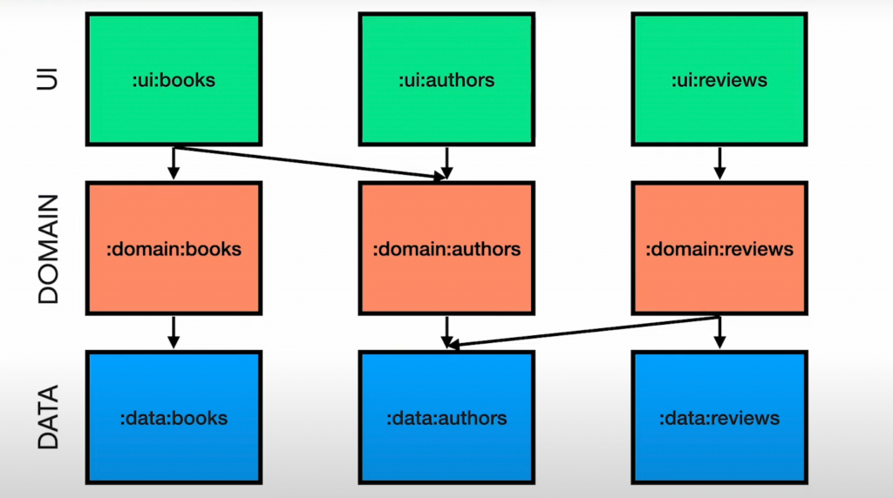

# 나만의 와인을 찾는 여행 Winey의 안드로이드 레포지토리입니다.

## 구조 설명

기본적으로 멀티모듈을 활용해 앱을 구성하며
[찰스의 앱 모듈화 가이드](https://www.charlezz.com/?p=46545)를 참고하여 구성하였습니다.
app - domain - data 모듈로 구성되며 다음과 같은 레이어 층을 유지 합니다.

[Jetpack Compose로 디자인 시스템 만들기(우와콘)](https://www.youtube.com/watch?v=O1yPOr7J3gY&t=2412s)을 참고하여 
코어 디자인 시스템 모듈을 분리하여 디자인을 컴포넌트 단위로 관리합니다.
[core_design_system 모듈](./core_design_system)

## 깃 컨벤션

Feat : 새 기능 (new feature)
Fix : 버그 수정
Docs : 문서 수정
Style : 코드 스타일 관련 수정 (포맷팅 등 실제 코드 변화는 아닌 경우)
Refactor : 리팩토링 작업
Test : 테스트 코드의 추가나 테스트 코드에 대한 리팩토링 작업 (메인 코드는 변경 X)
Chore : 빌드와 관련된 것들을 업데이트하는 경우
Design : UI 변경 작업
Comment : 주석의 작성이나 변경
Rename : 파일, 폴더, 패키지 등의 이름만 수정하거나 옮기기만 한 경우
Remove : 파일 삭제만 한 경우

### 개발 환경

* [버전 정보](./buildSrc/src/main/java/Versions.kt)
* [사용 라이브러리](./buildSrc/src/main/java/Dependency.kt)

### 빌드 조건

* 그래들 버전 8.0.0 이상
* JDK 17
