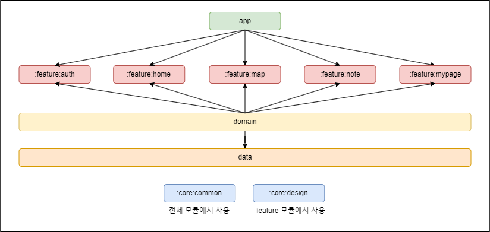

<h1 align="middle">나만의 와인을 찾는 여행, WINEY</h1>

  

## 구조 설명

기본적으로 멀티모듈을 활용해 앱을 구성하며 [일반적인 모듈화 패턴](https://developer.android.com/topic/modularization/patterns?hl=ko)과 [Now in Android](https://github.com/android/nowinandroid)를 참고하여 구성했습니다.

 

## 모듈 설명

- app: 앱 수준과 전체 코드베이스를 바인딩하는 계층으로, MainActivity, WineyApp 등 포함. feature 모듈의 navigation을 통합하여 관리

- data: 직접 데이터를 받아오는 계층으로 api, model, datasource, repository 포함
- feature: 각 기능 화면을 직접 표시하는 계층으로 uiState, viewmodel, screen, 그리고 해당 기능에 대한 navigation 포함
- core: 다른 모듈에서 자주 사용하는 코드가 포함

각 모듈에 대한 DI, 리소스는 해당 모듈에서 관리합니다.

 

## ✨ 핵심 기능

## 홈 화면

- **오늘의 와인**: 사용자가 작성한 테이스팅 노트를 기반으로 매일 와인 3종을 추천합니다.
- **와인 초보를 위한 TIP!**: 와인 추천과 관련된 유익한 아티클을 제공합니다.

## 와인 지도

- **주변 와인 가게 검색**: 사용자의 현재 위치를 기반으로 주변 와인 가게를 검색하고 표시합니다.

## 테이스팅 노트 작성

- **노트 작성**: 와인의 도수, 색, 향, 당도 등 세부 정보를 입력해 테이스팅 노트를 작성할 수 있습니다.

## 테이스팅 노트 목록 조회

- **필터링 기능**: 재구매 의사, 와인 타입, 생산지 등의 조건으로 테이스팅 노트를 필터링하여 검색할 수 있습니다.

## 테이스팅 노트 분석하기

- **분석 결과 시각화**: 사용자가 작성한 테이스팅 노트를 바탕으로 선호 품종, 국가, 맛, 향 등의 정보를 그래프로 시각화해 제공합니다.

 

## 라이브러리 & 프레임워크 🔧
| 카테고리 | 스택 |
|:----------|:----------:|
| Language | Kotlin |
| Architecture | MVI |
| DI | Hilt |
| Networking | Retrofit, OkHttp, GSON |
| Asynchronous | Coroutine, Flow |
| JetPack | AAC, ViewModel, Navigation, Repository |
| Local DB | DataStore |
| Image | Coil |
| Map | NaverMap |
